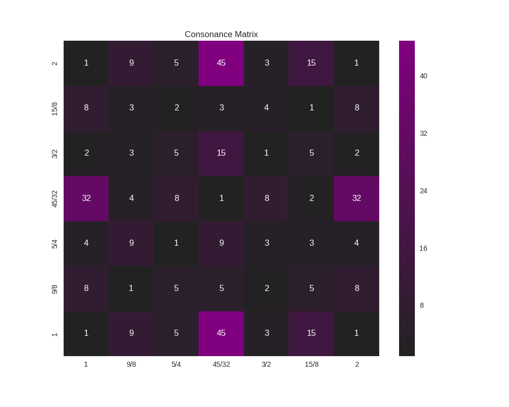
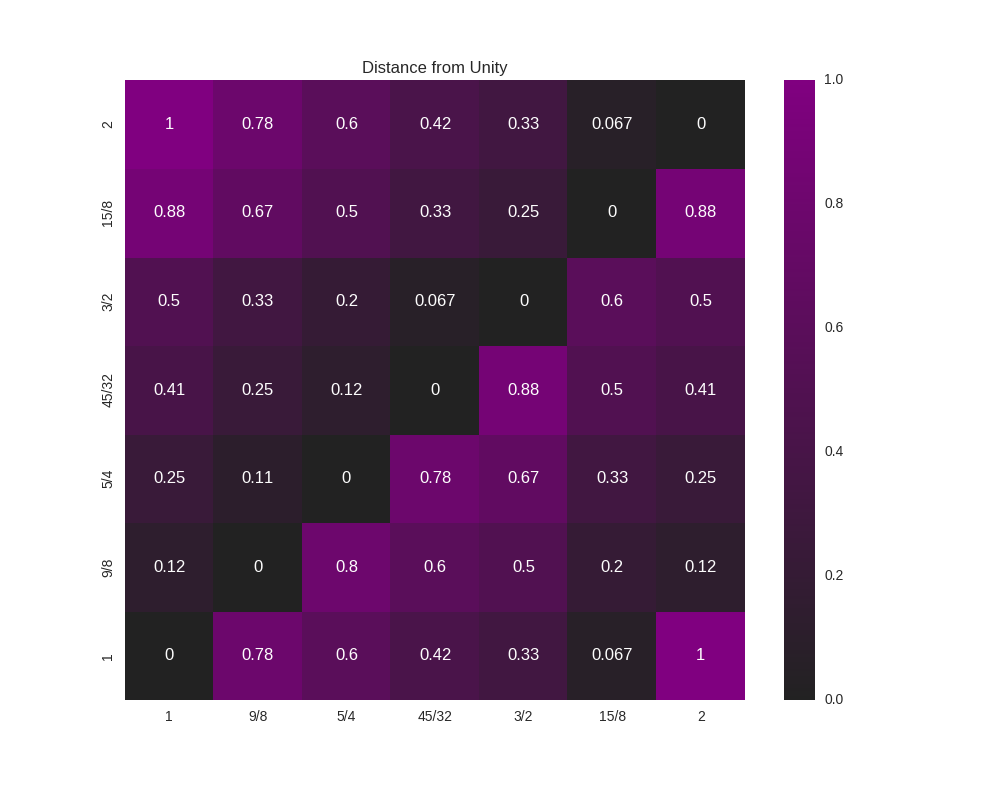
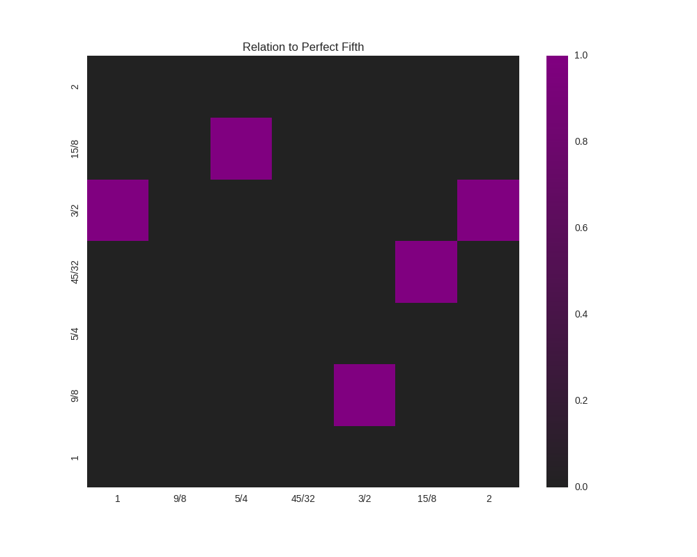

Visualizations
==============

PyTuning includes some visualizations for the analysis of scales, but this
is not yet fleshed out.

The graphics are via `Matplotlib <http://matplotlib.org/>`__, which is the *de facto*
implementation of analytical graphics for python. There is also an optional
dependency on `Seaborn <http://seaborn.pydata.org/>`__. Seaborn is good to include
if you can -- it makes the graphs better -- but it's a large package, owning
to its dependencies (which include `SciPy <https://www.scipy.org/>`__
and `Pandas <http://pandas.pydata.org/>`__; great packages, but
extensive and large). If you have disk space to spare you may want to install it;
otherwise you can get my with Matplotlib alone. On my system SciPy and Pandas
weigh in at about 200 megabytes, not including any dependencies that *they* require.
Matplotlib, on the other hand, is about 26 megabytes.

The Consonance Matrix
---------------------

It's nice to be able to get an intuitive feeling for the consonance or dissonance
of a scale. For this, the **consonance matrix** is provided.

The consonance matrix forms an interval between every degree in the scale and
applies a metric function to it. The default metric function just measures the
denominator of the interval after any simplification it can undergo
(and is really only meaningful for degrees which are expressed an integer ratios).

As an example, we can create a scale of the Euler-Fokker type:

.. code:: python

  scale = create_euler_fokker_scale([3,5],[2,1])

which is

.. math::

  \left [ 1, \quad \frac{9}{8}, \quad \frac{5}{4}, \quad \frac{45}{32},
  \quad \frac{3}{2}, \quad \frac{15}{8}, \quad 2\right ]

Now, to create a consonance matrix:

.. code:: python

  from pytuning.visualizations import consonance_matrix
  matrix = consonance_matrix(scale)

``matrix`` now contains a matplotlib ``Figure``. To write it as PNG::

  matrix.savefig('consonance.png')

Which yields:

Because this function accepts an arbitrary metric, it can be used for any analysis
performed on the intervals of a scale; it does not need to really be a measurement
or estimate of consonance. As an example, let's say that (for some reason) you're
interested in how far from unity each interval is:

.. code:: python

  def metric_unity(degree):
      normalized_degree = normalize_interval(degree)
      y = abs (1.0 - normalized_degree.evalf())
      return y

  scale = create_euler_fokker_scale([3,5],[2,1])
  matrix = consonance_matrix(scale, metric_function=metric_unity, title="Distance from Unity")

Our graph now looks like:

We could even do something like look for perfect fifths within our scale:

.. code:: python

  def metric_fifth(degree):
      p5 = sp.Rational(3,2)
      normalized_degree = normalize_interval(degree)
      y = normalize_interval(p5 / normalized_degree).evalf()
      y = y if y == 1 else 0
      return y

  scale = create_euler_fokker_scale([3,5],[2,1])
  matrix = consonance_matrix(scale, metric_function=metric_fifth,
    title="Relation to Perfect Fifth", annot=False)

which gives us:

where the highlighted cells denote perfect fifths.

You'll note that the entry for :math:`\frac{45}{32}` and :math:`\frac{15}{8}` is 1
(a perfect fifth). We can verify this::

  print(normalize_interval(sp.Rational(45,32)  / sp.Rational(15,8)))
  3/2

.. autofunction:: pytuning.visualizations.consonance_matrix
