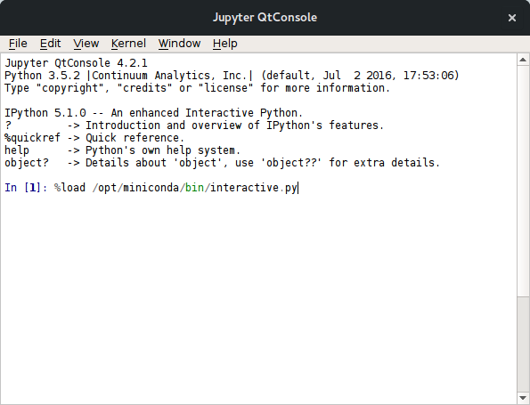
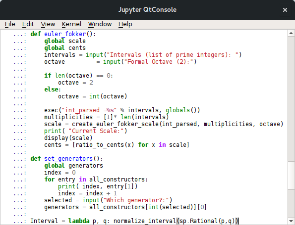
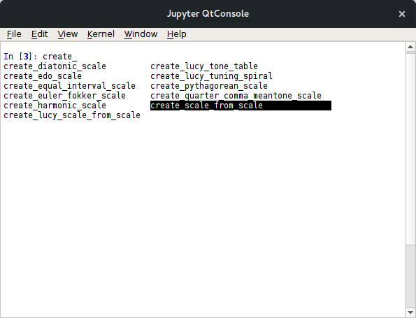
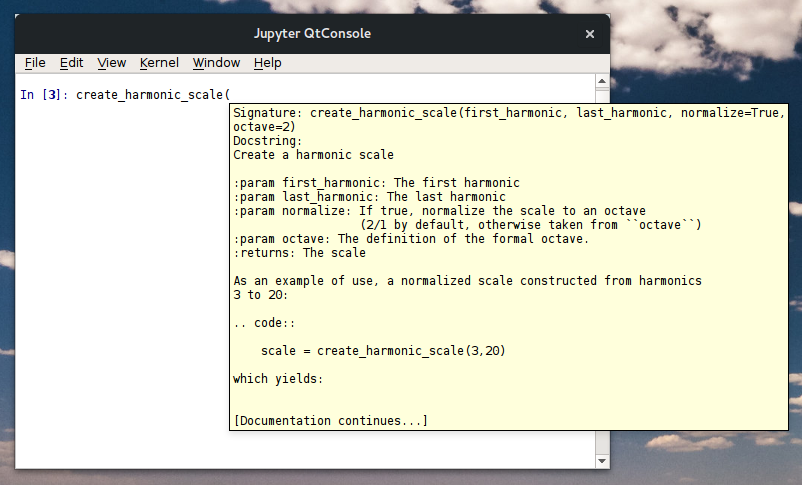
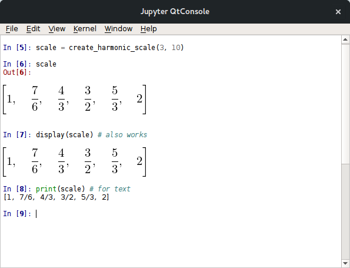
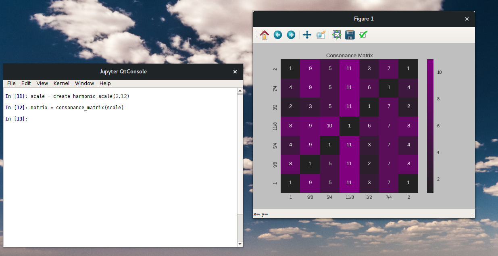
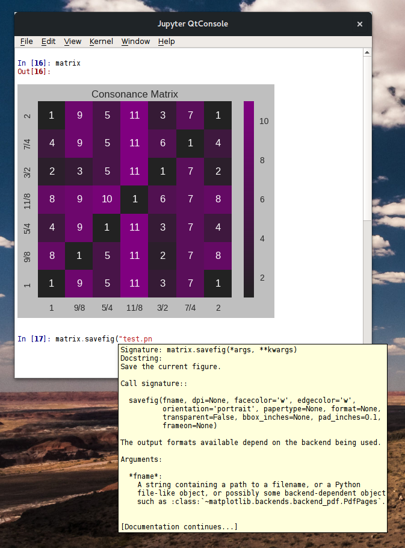
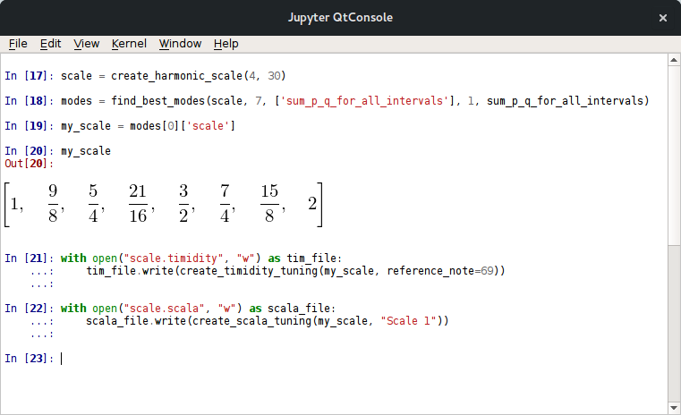
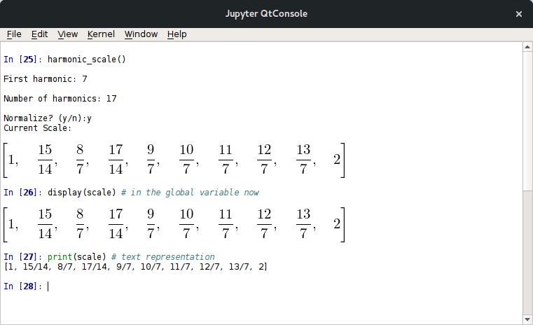

Using PyTuning Interactively
============================

With a little knowledge of Python, one can use PyTuning in an
interactive environment.

If you plan on doing this, I recommend using the `Jupyter
QtConsole <http://jupyter.org/qtconsole/stable/>`__. Jupyter is a
full-featured interactive environment for several programming languages
(the project started as IPython, but has expanded to cover many
languages).

Included in the distribution is a script, ``interactive.py``, which is
useful for setting up your environment.

Installing Jupyter
------------------

(Note: I have experience with Linux and MacOS, so these instructions are
focused on these platforms. Jupyter runs under Windows, but I have no
experience on that platform.)

On Linux, good ways of installing Jupyter include using your native
package manager or installing it via a third-party distribution.

Native Packages
...............

On Ubuntu Jupyter is still referred to as IPython. On Xenial, for example,
there are packages for both Python 2.7 and Python 3:

.. code:: bash

  vagrant@ubuntu-xenial:~$ aptitude search qtconsole
  p   ipython-qtconsole                       - enhanced interactive Python shell - Qt console
  p   ipython3-qtconsole                      - enhanced interactive Python 3 shell - Qt console
  vagrant@ubuntu-xenial:~$

On Arch Linux:

.. code:: bash

  mark@lucid:~$ pacman -Ss qtconsole
  community/python-qtconsole 4.2.1-1
      Qt-based console for Jupyter with support for rich media output
  community/python2-qtconsole 4.2.1-1
      Qt-based console for Jupyter with support for rich media output
  mark@lucid:~$

(PyTuning will run under either Python 2.7 or Python 3.X, so the version
you install is up to you.)

I would also suggest installing Matplotlib so that graphics can be used
within the console, i.e:

.. code:: bash

  vagrant@ubuntu-xenial:~$ aptitude search matplotlib
  p   python-matplotlib                        - Python based plotting system in a style similar to
  p   python-matplotlib:i386                   - Python based plotting system in a style similar to
  p   python-matplotlib-data                   - Python based plotting system (data package)
  p   python-matplotlib-dbg                    - Python based plotting system (debug extension)
  p   python-matplotlib-dbg:i386               - Python based plotting system (debug extension)
  p   python-matplotlib-doc                    - Python based plotting system (documentation packag
  p   python-matplotlib-venn                   - Python plotting area-proportional two- and three-w
  p   python3-matplotlib                       - Python based plotting system in a style similar to
  p   python3-matplotlib:i386                  - Python based plotting system in a style similar to
  p   python3-matplotlib-dbg                   - Python based plotting system (debug extension, Pyt
  p   python3-matplotlib-dbg:i386              - Python based plotting system (debug extension, Pyt
  p   python3-matplotlib-venn                  - Python 3 plotting area-proportional two- and three
  vagrant@ubuntu-xenial:~$

And optionally Seaborn:

.. code:: bash

  vagrant@ubuntu-xenial:~$ aptitude search seaborn
  p   python-seaborn                           - statistical visualization library
  p   python3-seaborn                          - statistical visualization library
  vagrant@ubuntu-xenial:~$

(But note that Seaborn is a bit large. See the discussion in :doc:`graphics`.)

Third Party Packages
....................

Jupyter can also be installed via third-party Python distributions. This
is my preferred way of doing it, and on MacOS it is (in my opinion) the
only viable option. I imagine that a third-party distribution would be
the easiest way to do this on Windows.

One good distribution is Continuum Analytics `Miniconda
<http://conda.pydata.org/miniconda.html>`__. Once
miniconda is `installed <http://conda.pydata.org/docs/install/quick.html>`__, the
``conda`` tool can be used to install the necessary packages:

.. code:: bash

  vagrant@ubuntu-xenial:~$ conda install jupyter qtconsole matplotlib seaborn sympy numpy

Setting the Environment
-----------------------

The PyTuning distribution contains a script, ``interactive.py``, that can
be used to import the package into your namespace, as well as setting up
some convenience functions. Where that script lives on your computer can
vary by platform as well as python distribution. If you're on Linux
and installed PyTuning with your system python, there's a good chance
it's in ``/usr/bin``. If you installed into the Miniconda distribution, then
it will probably be somewhere like ``~/miniconda/bin``.

Once you've launched the console, this script should be loaded into
the environment with the ``%load`` command. This will load it into the console,
but you'll need to execute it. This is normally done with ``Shift-Enter``,
although ``Control-enter`` may be used on some platforms/versions.

This will bring load the script into the console, at which point a
``[Shit-Enter]`` will execute it.

A (Very) Brief Introduction to Jupyter
--------------------------------------

There are a few things about Jupyter which are useful for
interacting with the Python interpreter.

Tab Completion
..............

Jupyter has a very good tab completion system which can save a lot
of typing.

As a first example, the ``%load`` command (above) can use completion
to navigate to the file. One need only type enough to disambiguate each
directory in the path and the tab will complete it, much in the same
way that the bash shell will do so.

Tab completion can also be used to find functions that are defined
in your namespace. As an example, by typing ``create_`` into the
console and hitting tab you will see all objects and functions that
begin with that string, and by hitting the tab a second time a selector
will be brought up that allows you to select the function you're
after:

Tool Tips
.........

Jupyter also has a nice tool-tip function that will show a function's
documentation once the opening ``(`` is typed:

History
.......

Jupyter also has a nice history function. If, for example, at some point
in your session you entered the following:

.. code::

  In [3]: scale = create_harmonic_scale(2,6)

  In [4]:

Then, later on in the session if you type ``scale =``, each time you
hit the up arrow it will search through your history and bring up lines
beginning with that character string. You can then edit that line and make
changes.

.. code::

  In [3]: scale = create_harmonic_scale(2,6)

  In [4]: scale2 = create_harmonic_scale(2,7)

  In [5]:

Rich Display
............

By default scales and degrees will be displayed symbolically. If you want
text display you can use the :func:`print` function.

Graphics
........

With ``matplotlib`` installed one also has access to graphics. A graph can
be displayed within the console, or it can be displayed in a simple
viewer that allows some editing and the saving of the graphic file in
a few different formats (JPEG, PNG, SVG). The viewer comes up automatically.
If you close it at want to bring it back up later, you can use the ``show()``
function (i.e., ``matrix.show()``).

Note that by re-sizing the window, you re-size the graphic.

You can also save the figure directly from the console:

A Sample Session
----------------

On my personal website I `discuss a scale <http://www.pataphysical.info/a-new-musical-scale.html>`__
that I've been working with recently for music composition. It's a mode
of the harmonic scale which minimizes dissonance by one of the metrics
included in the distribution. In the following session I create the scale
and create two tuning tables (a timidity and scala table) for use in
music composition.

Helper Functions
----------------

``interactive.py`` also creates a few helper functions for the creation
of scales. They wrap the base functions in an interactive prompt and
define a global variable, ``scales`` into which the calculated scale
is placed.

As an example, to create a harmonic scale:

Only a few functions have yet been written, but more will be included in
future releases.

.. autofunction:: pytuning.interactive.harmonic_scale

.. autofunction:: pytuning.interactive.edo_scale

.. autofunction:: pytuning.interactive.euler_fokker

Running in a Persistant Way
---------------------------

Jupyter also offers an `interactive notebook <http://jupyter.org/>`__, similar
to a Matlab notebook. For more complicated analysis it is my preferred way
of interacting with the PyTuning library. Documentation, graphics, equations, code,
and output calculations can all be included. It can be installed in a way
that is similar to the console (and in fact may be installed along with it,
depending on how the packages maintainers on your platform have chosen to
break things up).

The Github repository for this project has a directory which
contains a `rendered notebook <https://github.com/MarkCWirt/PyTuning/tree/master/docs/notebooks>`__
that shows an exploration of pentatonic scales in the Pythagorean tuning.
Github renders notebooks well, so you can see what's possible to decide if you
want to install the software. If you're going to be doing anything really
complicated in an interactive environment, I would recommend installing and
using this.
